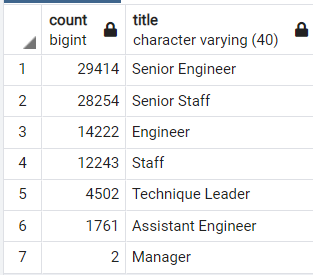
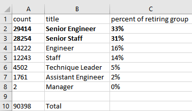
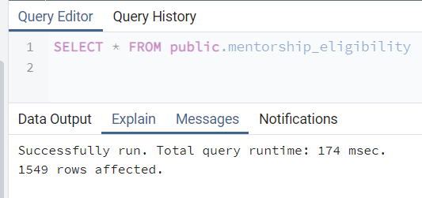
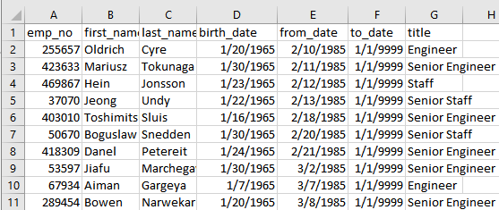

# Pewlett-Hackard-Analysis
## Overview
### Silver Tsunami Analysis
Pewlett Hackard has requested an internal employee analysis to prepare for a high percentage of upcoming retirements. First, the analysis filtered employees to identify those nearing retirement. Then these were grouped by title to see how many employees may be retiring from each position. Finally, to mitigate the impact of losing the most experienced employees, two department managers requested information to prepare to pitch a mentorship program to the CEO. 

## Results
### retiring_titles and mentorship_eligibility table inferences

- We have extracted seven different position titles held by the specified age group. 

- About 64% of the upcoming retirement age group most recently held Senior Engineer or Senior Staff titles. 
- Pewlett Hackard has employeed 90,000 employees in the upcoming retirement age group. 

- There are 1,549 employess from the upcoming retirement group who could be eligible for the mentorship program. Dates from the Salary table are not employment dates, so we used the dept_employees table to filter out ex-employees of Pewlett Hackard.

- The mentorship_count table is sorted in order of ascending employee number. However, the employee number does not reflect seniority of the employee, as seen when sorted by start dates. 

## Summary
### How many roles will need to be filled as the "silver tsunami" begins to make an impact?
The following query gives the number of current employees who were born between 1952 and 1955, and hired between 1985 and 1988: a total of 33,118.
"SELECT ri.emp_no,
    ri.first_name,
    ri.last_name,
	de.to_date
INTO current_emp
FROM retirement_info as ri --retirement eligible
LEFT JOIN dept_employees as de
ON ri.emp_no = de.emp_no
WHERE de.to_date = ('9999-01-01');  -- current employees"

### Are there enough qualified, retirement-ready employees in the departments to mentor the next generation of Pewlett Hackard employees?
No. There will be less employees in each department mentoring than will need to be replaced. We can see how many will need to be replaced in each department:
"SELECT e.emp_no,
    e.first_name,
	e.last_name,
	d.dept_name
INTO depts_retire
FROM employees as e
INNER JOIN dept_employees as de
ON (e.emp_no = de.emp_no)
INNER JOIN departments as d
ON (d.dept_no = de.dept_no)
WHERE (e.birth_date BETWEEN '1952-01-01' AND '1955-12-31')
AND (hire_date BETWEEN '1985-01-01' AND '1988-12-31')

SELECT DISTINCT ON (rt.emp_no) rt.emp_no,
	rt.first_name,
	rt.last_name,
	rt.dept_name
INTO depts_unique
FROM depts_retire AS rt
ORDER BY rt.emp_no;

SELECT COUNT(ut.emp_no), ut.dept_name
INTO depts_count
FROM depts_unique as ut
GROUP BY ut.dept_name
ORDER BY ut.count DESC;"

